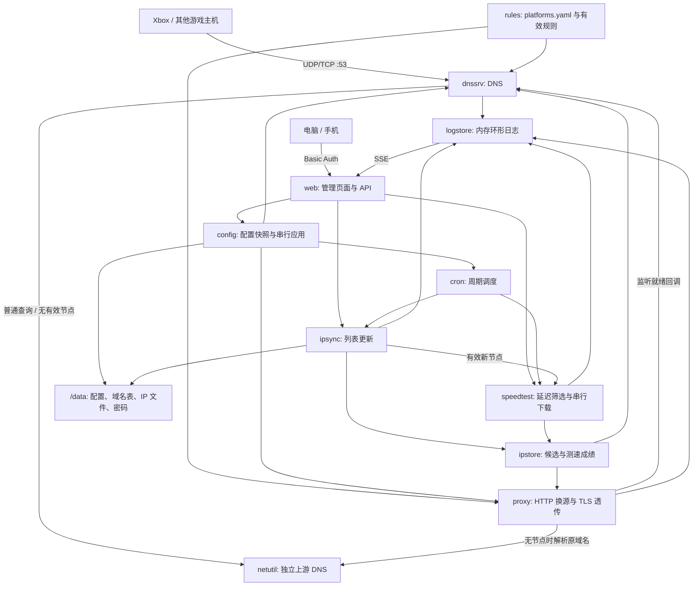
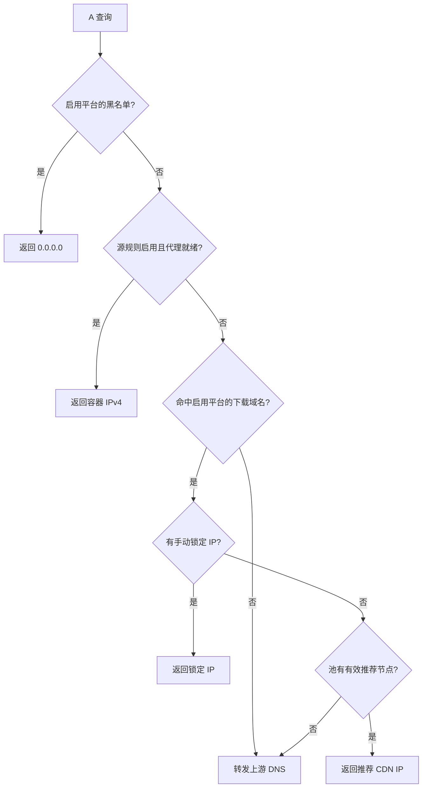
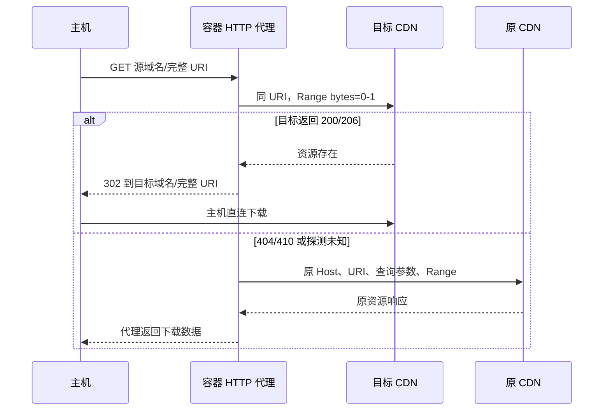
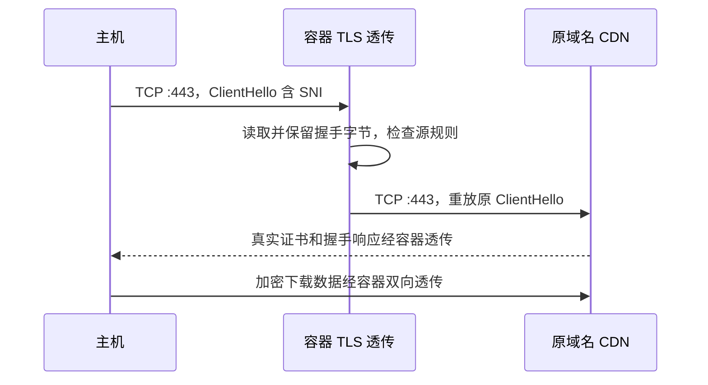

# 项目架构与工作原理

本说明对应 `rosemengzi/xbox-speedup` 当前修复版。功能入口见 [README](README.md)，部署见 [NAS 指南](docs/deploy-synology.md)，操作见 [使用说明](docs/user-guide.md)。

## 1. 整体结构

运行形态是 **单个 Go 进程、单个 Docker 容器**。DNS、IP 同步、测速、下载代理、管理 API 与静态网页都在同一个二进制中。没有单独的 dnsmasq/Nginx，没有数据库，也没有 Redis。

Docker 的 macvlan 为容器提供独立局域网 IP。主机把 DNS 指向该 IP；电脑或手机通过同一 IP 的管理端口操作服务。数据目录以 bind mount 持久化。



同步后的自动增量测速有条件：自动测速已开启，且新节点属于启用、未隐藏、勾选测速、未锁定的平台对应池。同步本身仍更新所有已定义的池。

## 2. 目录与模块职责

```text
xbox-speedup/
├── cmd/xboxspeedup/
│   ├── main.go              初始化、依赖装配、启动、配置回调与退出
│   ├── scheduler.go         cron 任务创建、校验和重建
│   └── seed.go              首次播种，保留已有用户数据
├── internal/
│   ├── config/              YAML/JSON 配置、校验、快照、串行应用与回滚
│   ├── rules/               平台表、域名索引、合并换源规则、循环校验
│   ├── ipstore/             候选 IP、位置、RTT、下载速度和当前推荐节点
│   ├── ipsync/              上游列表、下载源回退、解析校验与缓存更新
│   ├── speedtest/           ICMP/TCP 延迟与有界下载测量
│   ├── dnssrv/              DNS 的 UDP/TCP 监听和解析决策
│   ├── proxy/
│   │   ├── proxy.go         HTTP 302、探测合并、原域名回源、监听生命周期
│   │   ├── cache.go         有界资源结论缓存
│   │   └── tls.go           ClientHello SNI 读取、原始 TLS 字节透传
│   ├── netutil/
│   │   ├── dns.go           上游切换、截断转 TCP、独立 IPv4 解析
│   │   └── netutil.go       出口地址与强制连接节点的 HTTP Transport
│   ├── persist/             临时文件、fsync、原子替换
│   ├── logstore/            非阻塞日志广播和环形缓冲
│   └── web/
│       ├── auth.go          密码加载、Basic Auth、跨来源检查与健康接口
│       ├── web.go           状态、配置、池详情、任务、SSE API
│       └── ui/              内嵌网页、图标和移动端布局
├── data/
│   ├── platforms.yaml       镜像内置的平台、池、域名和测试 URL
│   └── ip/                  首次启动用的候选节点快照
├── configs/config.example.yaml
├── docs/                    部署、使用、配置、换源和维护文档
├── .github/workflows/container.yml
├── .env.example
├── docker-compose.yml
├── Dockerfile
└── go.mod
```

模块通过注入的函数连接：主程序把有效规则、平台/池查找、锁定 IP 查询、代理就绪、任务触发和健康状态传给相应模块。DNS 与代理共享平台开关和规则计算，避免一端停用、另一端继续接管。

## 3. 进程启动和退出

启动顺序：

1. 确定数据路径，向尚不存在的文件播种 `platforms.yaml` 和 IP 快照。
2. 加载/创建 `config.yaml`，校验配置与合并后的规则；保存启动配置用于比较重启需求。
3. 建立日志与 IP 存储，从本地 IP 文件读取候选，不立即联网同步。
4. 创建测速引擎及下载代理，注入有效规则、手动/自动 IP 选择和容器自身 IP。
5. 启动 UDP/TCP DNS，两个传输均绑定成功并通知就绪后才返回。
6. 如果换源启用，绑定 HTTP 与 TLS 下载监听；失败时进程启动失败，避免只启动一半的代理。
7. 注册配置应用回调，加载管理密码，启动管理 HTTP 与可选管理 HTTPS。
8. 安排 cron；自动测速开启时启动后台首轮测速。
9. 收到 SIGINT/SIGTERM 后取消后台上下文、停止调度，关闭 Web、代理和 DNS。

没有自动测速成绩时 DNS 回退上游；不能因为已有 IP 列表就把其中第一项返回成「最快 IP」。

## 4. DNS 决策路径

域名使用大小写无关的精确匹配，平台停用/隐藏后不加入运行索引。A 查询按以下顺序处理：



服务自行生成的 A 应答 TTL 为 30 秒。上游应答沿用上游记录；客户端缓存和已有下载连接不随配置立即撤销。

AAAA 查询在 `ipv6_filter` 开启且域名属于以下范围时返回空记录：启用平台黑名单、就绪代理接管域名、具有锁定/有效自动 IPv4 的下载域名。无有效 IPv4 时保留上游 AAAA，普通域名也继续转发。

上游转发先用 UDP，应答截断则对同一上游改用 TCP；传输错误、SERVFAIL、REFUSED 或仍然截断时尝试下一个上游，全部失败返回 SERVFAIL。普通 DNS 转发的整体上下文上限为 5 秒，单次客户端超时为 2 秒。这里没有实现完整递归解析器或独立的通用 DNS 缓存。

## 5. IP 同步与测速算法

### 5.1 列表更新

`ipsync` 按 `/data/platforms.yaml` 的池定义取文件。数据来源是 XboxDownload 的 IP 目录；先尝试配置的下载前缀/直连路径，最后尝试内置 jsDelivr 地址。

每个下载最多读取 4 MiB；要求有效首行关键字和非空 IPv4 结果。解析时去重并剔除非法、IPv6、未指定及组播地址。校验完成后原子写缓存，再更新内存池；失败时继续保留原列表，不用错误页覆盖缓存。

`SetList` 保留仍在列表中的已有成绩，剔除已删除节点；若原冠军被删除则清空。启动时只读取本地候选，不恢复上次进程的测速成绩。

### 5.2 节点测量

有下载测试 URL 的池：

1. 对候选测延迟，优先 ICMP；没有权限或 ICMP 不通时回退 TCP `80` 连接耗时，延迟阶段最多 50 个并发。
2. 取低延迟前 N 项，完整重排时清理其他候选的旧下载成绩。
3. 对前 N 个节点逐一下载；完整测量可复用新鲜度窗口内的有效成绩。
4. 直接连接候选 IP，同时保留测试 URL 的 Host；发送 Range 和 identity 编码请求。
5. 只接受 200/206；206 检查 Content-Range，最多实际读取配置的字节数，并要求有效样本量。
6. 按当前有效下载速度选择冠军；下载失败不以延迟成绩兜底。

测试 URL 为空的池调用独立的延迟选优策略；当前 `XboxApp` 属于此类。下载型池没有有效成绩时保持空冠军，DNS 使用上游。

全局引擎只允许一个测速任务运行；并发触发不会重复占用出口带宽。样本速度单位为 MiB/s，是该测试资源、该时段的估计值。共享池的平台共享自动成绩；平台锁定 IP 独立于池冠军。

新鲜度用于下一轮是否复用成绩，不是持续节点健康检测。当前冠军和历史成绩均在内存中，重启后清空。

## 6. HTTP 换源和智能兜底

仅在换源开启、规则有效且两个下载监听就绪时，DNS 才把源域名解析到容器。HTTP 读取 Host 与完整 RequestURI。



关闭智能兜底时直接 302。开启后只缓存 200/206 的存在结论，以及 404/410 的缺失结论；403、5xx、超时及网络错误选择本次回源，但不写缺失缓存。

缓存键包含规则版本、目标主机、目标 IP 和完整 URI，TTL 为 5 分钟，上限 4096 项。相同探测用 `singleflight` 合并；修改配置会更新规则版本，因此不继续复用旧规则的结论。

回源使用原域名节点：先锁定/自动推荐，无有效节点时向独立上游 DNS 解析，拒绝连接到容器自身 IP，防止代理解析回环。目标缺失时不能 302 回原域名，因为其 DNS 已被接管到容器。

## 7. HTTPS 原字节透传



实现使用 Go TLS 解析器读取 ClientHello；捕获读入的原始字节，并在得到 SNI 后停止本地握手，丢弃解析器产生的输出。主机真正的 TLS 对端仍是 CDN，容器不会返回自己的下载证书。

只允许当前启用源规则中的 SNI；连接到原域名节点的 `443`，不访问规则 `to` 的 HTTPS。没有手动/自动 IP 时同样使用独立上游解析。原始握手后双向复制字节，保留证书验证和加密请求。

当前限制：握手读取 10 秒、握手前缀最多 128 KiB、最多 128 个同时接入的透传会话；空闲连接使用可随数据活动刷新的 2 分钟超时。关闭代理会关闭已跟踪的会话。

明文 SNI 是路由前提；没有 QUIC/HTTP3、加密 SNI 路由或 HTTPS 域名换源。TLS 透传的下载数据经过 NAS，因此 NAS 的网卡、出口和转发能力影响实际速度。

## 8. 配置应用与管理面

配置应用流程：读取请求对象并复制可变字段 → 归一化及字段/规则校验 → 原子写文件 → 替换运行快照 → 调用代理/DNS/调度回调。整个保存与应用使用串行锁，防止多个更新交错；应用失败会尝试恢复旧文件、快照和服务配置，错误返回调用方。

HTTP/TLS 开关在回调中立即启停；DNS 根据代理的实际就绪状态决定是否接管。端口、管理证书、对外 IP 等以启动快照为准，更新后报告 `restart_required`。直接编辑 YAML 不走回调，需重启。

管理网页为 Go embed 的静态 HTML/JS。登录采用 Basic Auth，密码独立于配置：先取 `XBOX_WEB_TOKEN`，否则读取/生成 `/data/web-token`，文件权限为 `0600`。配置 API 不返回密码，程序启动日志也不打印密码。

修改接口要求 POST，检查浏览器跨来源请求并限制请求体为 1 MiB。前端串行提交配置，在待保存时避免刷新覆盖未保存对象，并显示保存错误。SSE 提供实时日志及 20 秒心跳。

`/healthz` 可匿名读取，检查 DNS 和已启用的下载监听是否就绪；不检验互联网、上游 DNS、CDN 或锁定 IP。

## 9. 端口、持久化与流量成本

| 端口 | 默认是否监听 | 用途 |
| --- | --- | --- |
| `53/udp`、`53/tcp` | 是 | 主机 DNS |
| `8080/tcp` | 是 | 认证管理 HTTP 与健康检查 |
| `80/tcp` | 否 | 换源开启后 HTTP 302/回源 |
| `443/tcp` | 否 | 换源开启后原域名 TLS 透传 |
| `8443/tcp` | 否 | 配置证书并启用管理 HTTPS 后监听 |

默认 Compose 使用独立 macvlan IP，不写宿主机端口映射。NAS DSM 的监听与容器 IP 分离；仍需保证容器 IP 和容器内端口没有冲突。

| 数据 | 位置/生命周期 |
| --- | --- |
| 配置、平台开关、锁定 IP | `/data/config.yaml`，持久化 |
| 用户平台表 | `/data/platforms.yaml`，持久化；升级不自动覆盖 |
| IP 候选和位置 | `/data/ip/*.txt`，持久化；在线同步更新 |
| 自动管理密码 | `/data/web-token`，持久化；环境变量密码优先 |
| 测速成绩、自动冠军 | 内存，重启重测 |
| 探测结论 | 内存缓存，重启清空 |
| Web 实时事件 | 3000 条内存环形缓冲，重启清空 |
| 管理 HTTPS 证书 | `/certs` 只读宿主机挂载 |

纯 DNS 优选及 HTTP 302 后的实际下载不经过容器；HTTP 回源和 HTTPS 透传经过容器。服务不会把游戏下载内容存入 NAS，也没有本地内容缓存命中能力。

## 10. 构建和验证范围

Go module 声明 Go 1.25；主要依赖为 miekg/dns、pro-bing、robfig/cron、yaml.v3 和 singleflight。运行镜像为 Alpine 3.23，含 CA 与时区数据。

GitHub Actions 从本仓库构建，先执行 `go test -race ./...`、`go vet ./...`，再发布 amd64/arm64 镜像、SHA 标签、构建来源证明与 SBOM。NAS 使用预构建镜像，不本地构建。

测试覆盖 DNS 无有效节点回退、AAAA、截断/TCP 与上游故障、平台开关、配置并发和回滚、URI/缓存、监听失败、TLS 1.2/1.3 原证书、下载采样上限、IP 校验和管理接口。另已做本地真实进程启动与开关/回滚检查。

这些检查确认程序边界行为，不等于已经验证用户的 NAS 网络和游戏提速。macvlan 可达性、实际 Xbox 下载、长连接、暂停/恢复和出口一致性仍需按 [验收方法](docs/user-guide.md) 实机检查。
