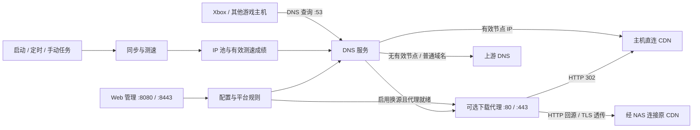

# Xbox 下载加速器

部署在 NAS 上的游戏主机下载加速服务。Xbox 把 DNS 指向本服务后，程序会按下载域名选择经过测速的 CDN 节点。无需常开 Windows 客户端，也无需在 NAS 上安装 Go 或自行开发程序。

本仓库是 [rosemengzi/xbox-speedup](https://github.com/rosemengzi/xbox-speedup)，基于 [ahaduoduoduo/xbox-speedup](https://github.com/ahaduoduoduo/xbox-speedup) 修复和扩展。域名及 IP 数据沿用 [skydevil88/XboxDownload](https://github.com/skydevil88/XboxDownload) 的主机加速思路，保留 MIT 许可证。

**建议先使用默认的 DNS 优选模式，比较实际下载速度，再按需开启 HTTP 换源与 HTTPS 透传。** 下载效果取决于运营商、CDN、游戏资源及出口线路，程序不会增加宽带本身的带宽。

## 文档导航

| 需要了解的内容 | 文档 |
| --- | --- |
| 功能、默认行为和快速开始 | 本 README |
| 模块架构、请求流程、测速算法与配置应用过程 | [架构说明](DETAILS.md) |
| 群晖/NAS 从准备网络到首次启动的完整步骤 | [部署指南](docs/deploy-synology.md) |
| 管理页面操作、平台开关、锁定 IP、验收和故障排查 | [详细使用说明](docs/user-guide.md) |
| 所有配置字段、默认值、环境变量及 API 调用 | [配置与 API 参考](docs/configuration.md) |
| HTTP 换源、智能兜底与 HTTPS 透传的区别 | [下载代理说明](docs/redirect.md) |
| 镜像构建、更新、固定版本、回退和数据备份 | [镜像与维护说明](docs/container-image.md) |
| 已完成内容及仍需实机验证的项目 | [进度记录](TODO.md) |

## 修改后的项目有哪些功能

| 功能 | 实际行为 |
| --- | --- |
| DNS 加速 | UDP/TCP DNS 服务，将匹配下载域名解析到手动锁定 IP 或有效的自动优选节点；主机直接连接 CDN |
| 可用性回退 | 没有测速结果、节点无有效下载成绩时使用上游 DNS，避免把未验证候选当作最快节点 |
| 上游 DNS 容错 | UDP 应答截断后使用 TCP 重试；网络错误、SERVFAIL、REFUSED 等情况尝试下一个上游 |
| 按需 IPv6 过滤 | 有有效 IPv4 节点或下载代理接管时过滤对应域名的 AAAA；没有节点时保留上游 IPv6，黑名单也参与过滤 |
| CDN 测速优选 | ICMP/TCP 延迟筛选前 N 个候选，再串行下载比较吞吐量；仅有延迟测试的池使用独立选择策略 |
| 平台管理 | 按平台启用、停用、参与测速或隐藏；停用/隐藏同时影响该平台的 DNS、黑名单和换源规则 |
| 手动锁定 IP | 固定平台使用的 IPv4；界面区分实际锁定 IP 与自动推荐 IP，清空后恢复自动选择 |
| HTTP 换源 | 可按域名将 HTTP 请求 302 到另一下载域名，保留路径、转义和查询参数 |
| 智能兜底 | 先探测目标资源，缺失或探测失败时代理原 CDN；按完整 URI、目标节点和规则版本缓存明确结论 |
| HTTPS 透传 | 用明文 SNI 确认允许的源域名，透传原始 TLS 字节；主机仍验证真实 CDN 证书 |
| 代理就绪检查 | HTTP/TLS 两个下载监听都正常后 DNS 才接管；启动失败回滚配置，运行失效后停止新的 DNS 接管 |
| 自动任务 | 启动测速、周期全量测速、周期 IP 同步；自动测速关闭后不再启动或在同步后自动测速 |
| IP 列表同步 | 在线更新、下载源回退、IPv4 校验去重、本地缓存、原子写入；同步失败保留原有列表 |
| Web 管理 | 桌面/移动页面、运行状态、IP 池详情、手动测速/同步、实时日志及类型筛选 |
| 管理认证 | 用户名 `admin`；密码来自环境变量或持久化文件；修改接口要求 POST 并检查跨来源请求 |
| 配置可靠应用 | 校验地址、IP、任务周期和规则循环，串行保存并原子写入；应用失败恢复旧配置 |
| 运维支持 | 公共 `/healthz` 就绪检查、Docker 日志轮转、持久化数据、独立管理 HTTPS 和重启提示 |
| 预构建镜像 | GitHub Actions 执行并发检测、静态检查，发布 `linux/amd64`、`linux/arm64` 镜像 |

### 支持的平台及默认设置

规则只作用于域名表列出的域名，并不覆盖某个平台的全部网络流量。平台默认值来自 [配置代码](internal/config/config.go)，域名和池定义见 [platforms.yaml](data/platforms.yaml)。

| 平台键 | 用途 | IP 池 | 默认加速 | 默认参与全量/自动测速 |
| --- | --- | --- | --- | --- |
| `XboxGlobal` | Xbox 国际下载域名 | `Akamai` | 开 | 是 |
| `XboxCn1` | Xbox 国内 assets 域名 | `XboxCn1` | 开 | 是 |
| `XboxCn2` | Xbox 国内 dlassets 域名 | `XboxCn2` | 开 | 是 |
| `XboxApp` | 微软商店 / Xbox App 的指定下载域名 | `XboxApp` | 开 | 否；该池只测延迟 |
| `Ps` | PlayStation 的指定下载域名 | `Ps` | 关 | 否 |
| `Ns` | Nintendo Switch 的指定下载域名 | `Akamai` | 关 | 否 |
| `Ea` | EA 的指定下载域名 | `Akamai` | 关 | 否 |
| `Battle` | 战网的指定下载域名及内置归并规则 | `Akamai` | 关 | 否 |

多个平台可以共享同一个池；例如 Xbox 国际、Switch、EA、战网共享 `Akamai` 的自动测速成绩。手动 IP 是平台级设置。`XboxApp` 默认没有测速成绩时使用上游解析，可开启其测速开关或点击该池的「测速」进行延迟优选。

### 默认运行方式

- DNS：`:53`，同时监听 UDP 和 TCP。
- Web 管理：`http://<容器IP>:8080`，需要登录。
- HTTP 换源及下载 HTTPS 透传：默认关闭；启用后同时监听 `:80`、`:443`。
- 管理 HTTPS：默认关闭，启用后默认 `:8443`，与下载 TLS 分开。
- 自动测速：开启，每 6 小时；每次服务启动也会触发一次。
- IP 同步：开启，每天 04:00；启动时先读本地列表，不立即在线同步。
- 时间：镜像默认 `Asia/Shanghai`，任务按容器时区运行。

## 原理与架构

这是一个 Go 进程，内置 DNS、测速引擎、下载代理和管理网页。部署只需要一个容器，不依赖额外的 dnsmasq、Nginx、数据库或 Redis。



| 模式 | DNS 返回什么 | 游戏下载数据是否经过 NAS |
| --- | --- | --- |
| DNS 优选 | 锁定 IP 或经过测速的 CDN IP | 否 |
| HTTP 换源成功 | 源域名返回容器 IP，HTTP 302 到目标域名 | 302 之后不经过 NAS |
| HTTP 智能兜底 | 源域名返回容器 IP，容器代理原 CDN | 是 |
| HTTPS 透传 | 源域名返回容器 IP，容器透传至原 CDN | 是 |

HTTPS 透传保留原域名，不把加密请求强制改成 `.cn`。下载 TLS 不需要给 Xbox 安装自签名证书，也不需要配置管理界面的 HTTPS 证书。更详细的请求顺序见 [架构说明](DETAILS.md)。

## 快速开始

以下是流程摘要；IP、网卡、网关和目录必须按实际环境填写。初次部署请按 [完整 NAS 部署指南](docs/deploy-synology.md) 操作。

1. 在 NAS 上准备本仓库的 `docker-compose.yml` 和 `.env.example`，将示例复制成 `.env`，填写容器 IP、数据目录和证书目录。
2. 创建一个与局域网对应的 macvlan 网络，并让 `.env` 的 `XBOX_NETWORK` 与其名称一致。
3. 在部署目录执行：

   ```bash
   sudo docker compose pull
   sudo docker compose up -d
   ```

4. 从另一台电脑或手机访问 `http://<容器IP>:8080`，使用 `admin` 登录。密码可在 `.env` 设置 `XBOX_WEB_TOKEN`；留空时从宿主机的数据目录读取 `web-token`。
5. 等待启动测速结束。需要更新列表时点击「同步 IP」，查看完成日志，再点击「全量测速」。确认需要的平台有有效节点或按需要锁定 IP。
6. 把 Xbox 的主 DNS 设为容器 IP；备用 DNS 避免使用会绕过本服务的公网 DNS。比较同一游戏的真实下载速度，检查暂停/恢复和联网是否正常。

镜像地址：

```text
ghcr.io/rosemengzi/xbox-speedup:latest
```

所有容器镜像由 GitHub Actions 构建。NAS 只拉取和运行镜像，不执行 `docker build` 或 `docker compose up --build`。

## 数据保存与升级

`XBOX_DATA_DIR` 对应宿主机的持久化目录，挂载到容器 `/data`。配置、平台表、IP 列表和自动生成的密码会保留。**测速成绩、自动推荐 IP、资源探测缓存及 Web 实时日志只在内存中，重启后重新建立。** 若关闭自动测速，重启后要手动测速或使用锁定 IP。

已有 `/data/platforms.yaml` 不会被镜像覆盖；升级后的新增域名需要手动合并并重启加载。Web 开关通过 API 立即应用；直接编辑磁盘 YAML 后需要重启。端口、证书等启动参数始终需要重启。

更新与回退步骤见 [维护说明](docs/container-image.md)。

## 功能边界与验证状态

- 本服务优化下载域名的解析与线路选择，不提供通用 VPN、游戏联机延迟优化或本地游戏文件缓存。
- 支持规则表中的精确域名；不自动捕获所有域名、不解析商店 API 获取新的下载地址。
- TLS 透传适用于带明文 SNI 的 TCP/TLS；没有 QUIC/HTTP3 转发和加密 SNI 路由。
- 管理密码与健康检查不代表 CDN 可用性；`/healthz` 只检查本服务监听就绪。
- 关闭下载代理会中断经它转发的连接；已经缓存的 DNS 应答不会立即撤销，调整后需等待缓存更新或重连下载。
- 回归测试覆盖 DNS 回退、上游容错、平台规则、配置回滚、资源探测、TLS 1.2/1.3 原证书透传、测速读取上限、IP 同步和管理认证。GitHub CI 执行 `go test -race ./...`、`go vet ./...` 并构建双架构镜像。
- 群晖 macvlan、Xbox 实际下载提速和长时间暂停/恢复仍需要实机验收，方法见 [使用说明](docs/user-guide.md)。

## 许可证

[MIT](LICENSE)
